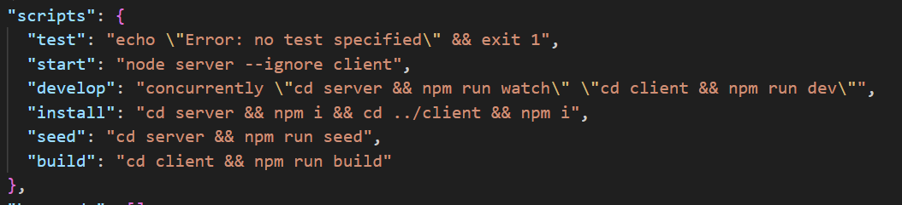
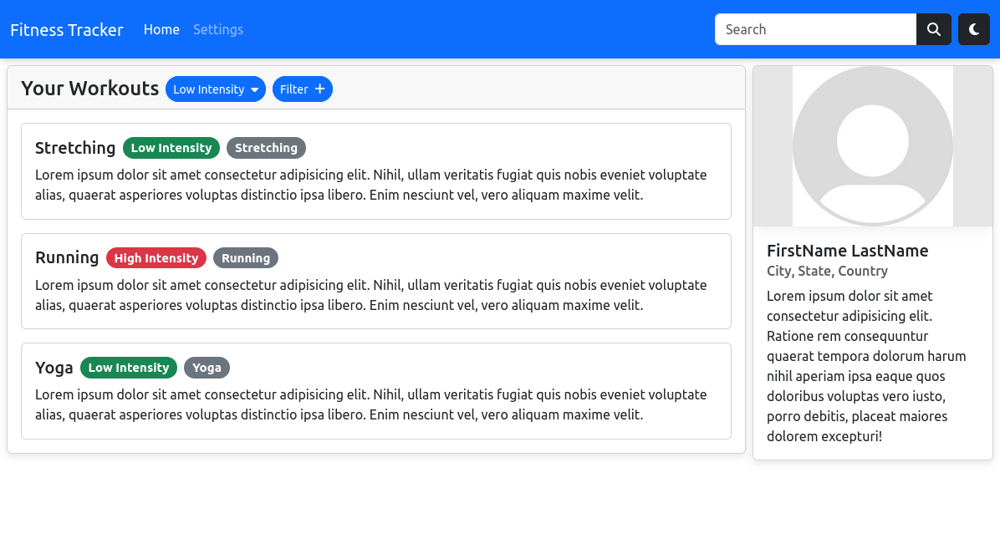
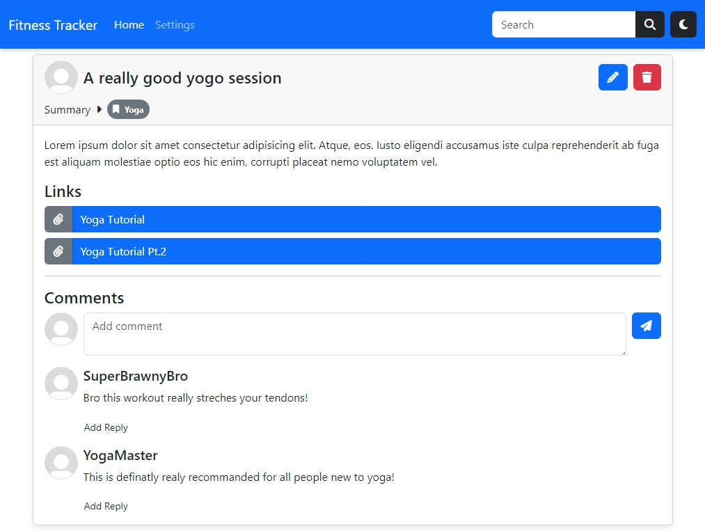

# Fitness Tracker
 Deployed Page Link:https://fitoness-tracker-779b260a5616.herokuapp.com/  
 Fitness Tracker Repo: https://github.com/Bfinch3/fitness-tracker 

Created by:
 Lindsey Carlso:https://github.com/lindseycarlson23   
 Billy Finch:https://github.com/Bfinch3  
 Chris Valada: https://github.com/clvalada 
 Fernando Valle: https://github.com/elmfer  
 Alberto Aleman Jr.:https://github.com/aalemanyz67  

## Objective
As a final project our team wanted to create a full stack MERN application to demonstrate the skills we have learned these past 3 months. We present our Fitness Tracker Application.

## Description

Looking for a way to track your favorite workouts! Checkout our Fitness Tracker Application. Our fitness app allows the user to login and create their own personal workout profile. Within their profile, the user can select the type of workout they are doing or just did and write a description about it. They can also make comments about the workout they just finished and if they recommend it. The user can also be part of a workout community by adding other users who are currently using the fitness app. 

## Table of Contents

- [Installation](#installation)
- [Usage](#usage)
- [Contributing](#contributing)
- [Tests](#tests)
- [Questions](#questions)
- [License](https://opensource.org/licenses/MIT)
- [Screenshots](#screenshots)

## Installation
Upon cloning our repo to your VS Code or code editor, please use the following installation guideline to make our Fitness Tracker function properly.
 Open up the integrated terminal at the root of our application follow the following commands. 
 npm install 
 npm run build 
 npm run seed 
 npm run develop 

## Usage
Once the homepage to our Fitness Tracker opens within the browser, you will need sign up to create your profile. Once there, you can create a new workout log. Upon clicking on the "Log New Workout" button a small window will appear in which you can create your new workout log. 

## Contributors and Resources
 Lindsey Carlso:https://github.com/lindseycarlson23 | Front End/Back End   
 Billy Finch:https://github.com/Bfinch3  | Back End/Front End  
 Chris Valada: https://github.com/clvalada | Front End 
 Fernando Valle: https://github.com/elmfer | Front End 
 Alberto Aleman Jr.:https://github.com/aalemanyz67 | Back End/Front End 

### Resources
The Fitness Tracker Application was built using the following packages and MERN Stack
   

Packages:
 @apollo/server 
 apollo-server-express 
 bcrypt 
 express 
 graphql 
 jsonwebtoken 
 mongoosedb 
 bootstrap 
 react-bootstrap 
 react-dom 
 react-router-dom 
 shadow 
 jwt-decode 
 @fortawesome/fontawesome-free 
vide 

## Tests

## Questions

For any questions, please contact me via:
 Lindsey Carlso:https://github.com/lindseycarlson23   
 Billy Finch:https://github.com/Bfinch3  
 Chris Valada: https://github.com/clvalada 
 Fernando Valle: https://github.com/elmfer  
 Alberto Aleman Jr.:https://github.com/aalemanyz67  

## License

This project is licensed under the [MIT License](https://opensource.org/licenses/MIT).

## Screenshots
Initial login page:
 

User creates a personal workout log:
 

Creating a workout log demo:
 

Editing and deleting workout log
 

User can add friends to their profile:
 

The workouts pages from November 28, 2023.

A single workout page from December 5, 2023.

# Lisence - MIT

